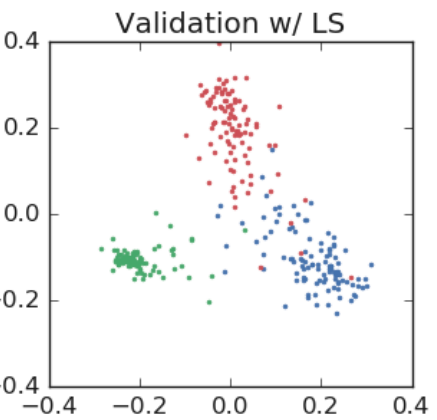

# Penultimate layer representations for observing label smoothing

Implementation of paper ["When Does Label Smoothing Help?"](https://arxiv.org/pdf/1906.02629.pdf)

### Ⅰ. Method

1. Pick three classes
2. Find an orthonormal basis of the plane crossing the templates of these three classes
3. Project the penultimate layer activations of examples from these three classes onto this plane

This visualization shows in 2-D how the activations cluster around the templates and how label smoothing enforces a structure on the distance between the examples and the clusters from the other classes.

<br>

### Ⅱ. Train Model (Alexnet)

```
python train.py ~/data cross_entropy.pth --label_smooth 0
python train.py ~/data label_smoothing.pth --label_smooth 0.1
```

<br>

### Ⅲ. Plot

```
python plot.py ~/data save/cross_entropy.pth --img_name cross_entropy
python plot.py ~/data save/label_smoothing.pth --img_name label_smoothing
```

<br>

### Ⅳ. Result

* result from this repo

| Loss |Train|Validation|
|:-:|:-:|:-:|
|Cross Entropy| ||
|Label Smoothing (eps=0.1)| | |

* result from the paper

| Loss |Train|Validation|
|:-:|:-:|:-:|
|Cross Entropy| ||
|Label Smoothing (eps=0.1)| | |
